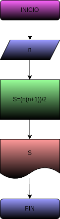

# Suma_n_Numeros
Programa para calcular la suma de los n primeros numeros naturales

# Analisis 

## Input
### Variables de entrada
n: numero al que se desea aplicar la formula
s: suma de los n primeros numeros
### Processing
s= (n*(n+1))/2
n= numero al que se desea aplicar la formula
### output
n,s
# Diseño

# Construccion